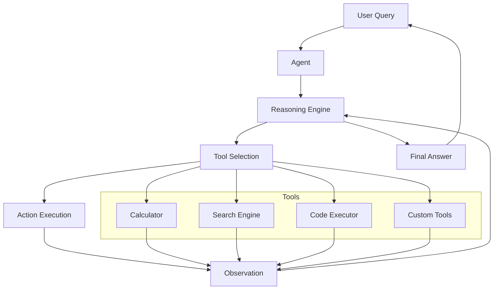

# Agents

This document explains the Agent framework in ZIO LangChain - autonomous systems that can use tools to solve complex tasks.

## Table of Contents

- [Introduction to Agents](#introduction-to-agents)
- [Agent Architecture](#agent-architecture)
- [Core Interfaces](#core-interfaces)
- [Reasoning Patterns](#reasoning-patterns)
- [Tools Integration](#tools-integration)
- [Usage Examples](#usage-examples)
- [Building Custom Agents](#building-custom-agents)
- [Advanced Features](#advanced-features)
- [Best Practices](#best-practices)

## Introduction to Agents

Agents are autonomous systems that can:

- Dynamically decide which actions to take
- Use multiple tools to accomplish tasks
- Reason through complex problems step-by-step
- Generate intermediate thoughts and actions
- Execute actions and observe results
- Iterate based on observations

Unlike static chains, agents make decisions at runtime about how to approach a problem, choosing from available tools based on their understanding of the task.

## Agent Architecture

The general architecture of an agent system is illustrated below:



## Core Interfaces

### Agent Interface

The foundation of agent functionality is the `Agent` trait:

```scala
trait Agent[-R, +E]:
  def run(input: String): ZIO[R, E, String]
```

This simple interface encapsulates the entire agent execution process, taking a user input and producing a final response.

### Tool Interface

Agents use tools to interact with the world or perform specific tasks:

```scala
trait Tool[-R, +E]:
  def name: String
  def description: String
  def execute(input: String): ZIO[R, E, String]
```

Each tool has:
- A name for identification
- A description that helps the agent understand when to use it
- An execution function that performs the actual operation

## Reasoning Patterns

ZIO LangChain supports multiple reasoning patterns for agents:

### ReAct (Reasoning, Acting, and Observing)

The ReAct pattern follows this sequence:
1. **Thought**: The agent thinks about what to do
2. **Action**: The agent selects a tool and provides input
3. **Observation**: The agent observes the result of the action
4. **Repeat** until reaching a final answer

```scala
class ReActAgent[R](
  llm: LLM,
  tools: Map[String, Tool[R, LLMError]],
  maxIterations: Int = 10
) extends Agent[R, AgentError]
```

### Function Calling

Function calling leverages LLM capabilities to directly call tools based on structured outputs:

```scala
class FunctionCallingAgent[R](
  llm: LLM,
  tools: Map[String, Tool[R, LLMError]],
  maxIterations: Int = 10
) extends Agent[R, AgentError]
```

## Tools Integration

### Standard Tools

ZIO LangChain provides several built-in tools:

1. **Calculator Tool**: Evaluates mathematical expressions
   ```scala
   val calculatorTool = Tool.make(
     "calculator", 
     "Calculate mathematical expressions"
   ) { input =>
     ZIO.attempt {
       val result = /* calculation */
       result.toString
     }
   }
   ```

2. **Search Tool**: Retrieves information from a search index
   ```scala
   val searchTool = Tool.make(
     "search", 
     "Search for information"
   ) { query =>
     // Implementation
   }
   ```

3. **LLM Tool**: Delegates to another LLM instance
   ```scala
   val llmTool = Tool.make(
     "language-model", 
     "Get answers from a language model"
   ) { query =>
     llm.complete(query)
   }
   ```

### Custom Tools

You can create custom tools for specific tasks:

```scala
val weatherTool = Tool.make(
  "weather", 
  "Get current weather for a location"
) { location =>
  ZIO.attemptBlockingIO {
    // Call weather API
    s"The weather in $location is sunny with a temperature of 72°F"
  }.mapError(e => new RuntimeException(s"Weather API error: ${e.getMessage}", e))
}
```

## Usage Examples

### Basic Agent Usage

```scala
import zio.*
import zio.langchain.core.agent.*
import zio.langchain.core.tool.*
import zio.langchain.core.model.*
import zio.langchain.integrations.openai.*

object AgentExample extends ZIOAppDefault:
  // Define tools
  val calculatorTool = Tool.make("calculator", "Calculate mathematical expressions") { input =>
    ZIO.attempt {
      val expression = input.trim
      val result = // calculate result
      result.toString
    }
  }
  
  val searchTool = Tool.make("search", "Search for information") { query =>
    ZIO.succeed(s"Search results for: $query")
  }
  
  // Create the agent
  def createAgent(llm: LLM): Agent[Any, AgentError] =
    ReActAgent(
      llm = llm,
      tools = Map(
        "calculator" -> calculatorTool,
        "search" -> searchTool
      ),
      maxIterations = 10
    )
  
  override def run =
    for
      llm <- ZIO.service[LLM]
      agent = createAgent(llm)
      result <- agent.run("What is the square root of 169 multiplied by 3?")
      _ <- Console.printLine(s"Agent result: $result")
    yield ()
    .provide(
      OpenAILLM.live,
      ZLayer.succeed(OpenAIConfig(...))
    )
```

### Agent with Multiple Tools and Memory

```scala
import zio.langchain.core.memory.Memory

object AdvancedAgentExample extends ZIOAppDefault:
  // Define additional tools
  val dateTool = Tool.make("date", "Get the current date and time") { _ =>
    ZIO.succeed(java.time.LocalDateTime.now().toString)
  }
  
  val weatherTool = Tool.make("weather", "Get weather for location") { location =>
    ZIO.succeed(s"The weather in $location is sunny with a temperature of 72°F")
  }
  
  // Create the agent with memory
  def createAgent(llm: LLM, memory: Memory): Agent[Any, AgentError] =
    new ConversationalAgent(
      llm = llm,
      tools = Map(
        "calculator" -> calculatorTool,
        "search" -> searchTool,
        "date" -> dateTool,
        "weather" -> weatherTool
      ),
      memory = memory,
      maxIterations = 15
    )
  
  override def run =
    for
      llm <- ZIO.service[LLM]
      memory <- ZIO.service[Memory]
      agent = createAgent(llm, memory)
      
      // Have a conversation with the agent
      _ <- Console.printLine("Agent ready. Type 'exit' to quit.")
      _ <- (for
        input <- Console.readLine
        _ <- ZIO.when(input.trim.toLowerCase != "exit") {
          for
            result <- agent.run(input)
            _ <- Console.printLine(s"Agent: $result")
            _ <- Console.printLine("\nWhat else would you like to know?")
          yield ()
        }
      ).repeatWhile(input => input.trim.toLowerCase != "exit")
    yield ()
    .provide(
      OpenAILLM.live,
      ChatMemory.volatile,
      ZLayer.succeed(OpenAIConfig(...))
    )
```

## Building Custom Agents

You can create custom agents by implementing the `Agent` trait:

```scala
import zio.langchain.core.agent.Agent
import zio.langchain.core.model.LLM
import zio.langchain.core.tool.Tool

class CustomAgent[R](
  llm: LLM,
  tools: Map[String, Tool[R, LLMError]],
  customConfig: CustomAgentConfig
) extends Agent[R, AgentError]:
  
  override def run(input: String): ZIO[R, AgentError, String] =
    for
      // Custom agent implementation
      initialPrompt <- buildInitialPrompt(input, tools, customConfig)
      response <- executeAgentLoop(initialPrompt)
    yield response.finalAnswer
    
  private def buildInitialPrompt(input: String, tools: Map[String, Tool[R, LLMError]], config: CustomAgentConfig): ZIO[Any, Nothing, String] =
    // Build prompt with tool descriptions and instructions
    
  private def executeAgentLoop(prompt: String): ZIO[R, AgentError, AgentResponse] =
    // Implement the agent's reasoning loop
```

## Advanced Features

### Parallel Tool Execution

For independent tools, improve performance with parallel execution:

```scala
def executeToolsInParallel(
  tools: Seq[(String, String)]
): ZIO[R, AgentError, Map[String, String]] = {
  ZIO.foreachPar(tools) { case (toolName, toolInput) =>
    tools.get(toolName) match {
      case Some(tool) => tool.execute(toolInput)
                               .map(result => toolName -> result)
                               .mapError(e => AgentError(e))
      case None => ZIO.fail(AgentError(new RuntimeException(s"Tool not found: $toolName")))
    }
  }.map(_.toMap)
}
```

### Context Management

Manage large contexts to avoid token limits:

```scala
def manageContext(history: Seq[AgentStep]): Seq[AgentStep] = {
  if (estimateTokens(history) > MAX_TOKENS) {
    // Summarize older steps
    val (oldSteps, recentSteps) = history.splitAt(history.size / 2)
    val summarizedOldSteps = summarizeSteps(oldSteps)
    summarizedOldSteps ++ recentSteps
  } else {
    history
  }
}
```

### Tool Verification

Add safety checks before executing tool actions:

```scala
def verifyToolAction(toolName: String, toolInput: String): ZIO[Any, AgentError, Unit] = {
  // Verify the action is safe and reasonable
  if (sensitiveToolNames.contains(toolName) && !isAuthorized(toolName, toolInput)) {
    ZIO.fail(AgentError(new SecurityException("Unauthorized tool access")))
  } else {
    ZIO.unit
  }
}
```

## Best Practices

1. **Clear Tool Descriptions**: Make tool descriptions specific and unambiguous to help the agent choose correctly.

2. **Iterative Testing**: Test agents with a variety of inputs to ensure robust behavior.

3. **Error Handling**: Implement proper error handling for tools, especially for external services.

4. **Monitoring**: Log agent decisions and tool executions for debugging and improvement.

5. **Token Efficiency**: Be mindful of token usage in prompts and tool responses.

6. **Safety Guards**: Implement safety checks for tools that could have harmful effects.

7. **Fallbacks**: Provide fallback mechanisms when tools fail or can't be accessed.

8. **Specialized Agents**: Build specialized agents for specific domains rather than one-size-fits-all agents.

9. **Context Management**: Implement strategies for managing context to avoid token limits.

10. **User Confirmation**: Consider adding confirmation steps for high-impact actions.