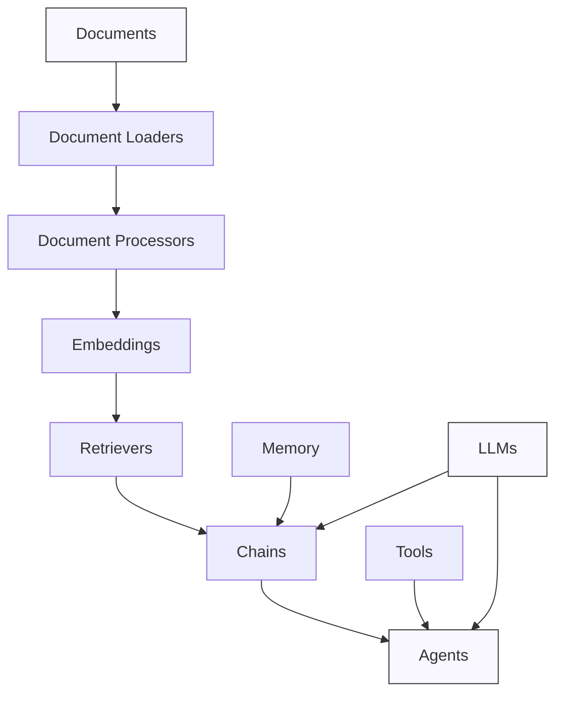

# Core Concepts

This section covers the fundamental concepts and abstractions that form the foundation of ZIO LangChain. Understanding these concepts is essential for effectively working with the library.

## Available Documentation

- [LLM Integration](llm-integration.md) - How to work with Large Language Models
- [Embeddings](embeddings.md) - Vector representations of text for semantic search
- [Memory](memory.md) - Conversation history and state management
- [Documents](documents.md) - Working with text documents and data
- [Retrieval](retrieval.md) - Finding relevant information from document collections
- [Chains](chains.md) - Composing operations into workflows
- [Agents](agents.md) - Autonomous systems that use tools to accomplish tasks
- [Tools](tools.md) - Components that agents can use to interact with the world

## Key Abstractions

ZIO LangChain is built around a set of core abstractions that work together:

### LLMs 

At the core of ZIO LangChain are the language model interfaces, which provide a unified way to interact with various LLM providers like OpenAI, Anthropic, and others.

### Documents

Documents represent text data with metadata, forming the foundation for information retrieval and knowledge bases.

### Embeddings

Embeddings convert text into vector representations that capture semantic meaning, enabling similarity search and retrieval.

### Memory

Memory components store conversation history and state, allowing for context-aware interactions in chatbots and assistants.

### Retrievers

Retrievers find relevant documents based on queries, forming the basis for Retrieval-Augmented Generation (RAG) systems.

### Chains

Chains combine multiple operations into cohesive workflows, allowing for complex processing pipelines.

### Agents

Agents are autonomous systems that can use tools to accomplish tasks through reasoning and action.

### Tools

Tools are components that agents can use to interact with the world, from simple calculators to complex APIs.

## Conceptual Relationships

The components in ZIO LangChain have specific relationships:

- **Documents → Embeddings**: Documents can be embedded for semantic search
- **Embeddings → Retrievers**: Embeddings power similarity-based retrieval
- **Retrievers → Chains**: Retrievers provide context to chains for RAG
- **Memory → Chains**: Memory provides conversation history to chains
- **LLMs → Chains**: Chains orchestrate LLM operations
- **Tools → Agents**: Agents use tools to perform actions
- **Chains → Agents**: Agents use chains for reasoning and planning

Understanding these relationships helps in designing effective LLM applications with ZIO LangChain.

## Next Steps

After familiarizing yourself with these core concepts, you can:

- Check out the [Examples](../examples/index.md) section for practical applications
- Explore the [Design](../design/architecture.md) section for architectural insights
- Review the API documentation for detailed reference