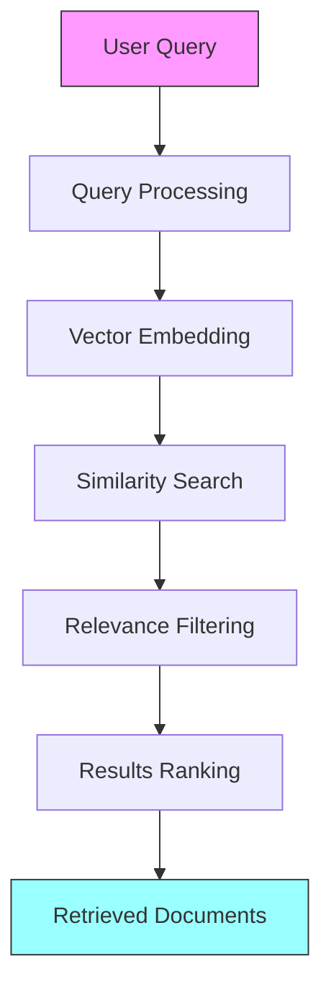

# Retrieval

This document explains the retrieval systems in ZIO LangChain - how they work, their importance, and how to use them effectively.

## Table of Contents

- [Introduction](#introduction)
- [Core Retriever Interface](#core-retriever-interface)
- [How Retrieval Works](#how-retrieval-works)
- [Retriever Types](#retriever-types)
- [Usage Examples](#usage-examples)
- [Implementing Custom Retrievers](#implementing-custom-retrievers)
- [Best Practices](#best-practices)

## Introduction

Retrieval systems are a fundamental component in many LLM applications. They allow you to:

- Find relevant information from large document collections
- Ground LLM responses in factual data
- Provide context for question answering
- Implement knowledge-based chatbots and assistants
- Create Retrieval-Augmented Generation (RAG) systems

Retrievers serve as the bridge between your data sources and language models, enabling more accurate, relevant, and contextual responses.

## Core Retriever Interface

ZIO LangChain provides a simple, powerful abstraction for retrieval through the `Retriever` trait:

```scala
trait Retriever:
  def retrieve(query: String, maxResults: Int = 10): ZIO[Any, RetrieverError, Seq[Document]]
```

This interface is intentionally minimal but powerful:

- Takes a query string and optional maximum number of results
- Returns a ZIO effect that produces a sequence of documents
- Uses typed errors through `RetrieverError`
- Is environment-agnostic, allowing for flexible implementation

## How Retrieval Works

The retrieval process typically involves these steps:



1. **Query Processing**: The input query may be preprocessed, expanded, or transformed.
2. **Vector Embedding**: The query is converted to a vector embedding.
3. **Similarity Search**: The system finds documents with similar embeddings.
4. **Relevance Filtering**: Results are filtered based on relevance criteria.
5. **Results Ranking**: The most relevant documents are ranked and selected.
6. **Document Return**: The top documents are returned to the caller.

## Retriever Types

ZIO LangChain supports several types of retrievers:

### Embedding-Based Retriever

The most common type uses embeddings for semantic search:

```scala
class EmbeddingRetriever(
  embeddingModel: EmbeddingModel,
  documentStore: DocumentStore,
  maxResults: Int = 10
) extends Retriever:
  override def retrieve(query: String, maxResults: Int = this.maxResults): ZIO[Any, RetrieverError, Seq[Document]] =
    for
      queryEmbedding <- embeddingModel.embed(query).mapError(e => RetrieverError(e))
      documents <- documentStore.findSimilar(queryEmbedding, maxResults)
                    .mapError(e => RetrieverError(e))
    yield documents
```

### Keyword-Based Retriever

For simpler use cases, keyword matching can be effective:

```scala
class KeywordRetriever(
  documents: Seq[Document],
  maxResults: Int = 10
) extends Retriever:
  override def retrieve(query: String, maxResults: Int = this.maxResults): ZIO[Any, RetrieverError, Seq[Document]] =
    ZIO.attempt {
      val keywords = query.toLowerCase.split("\\s+").toSet
      
      documents
        .map(doc => (doc, keywords.count(doc.content.toLowerCase.contains)))
        .filter(_._2 > 0)
        .sortBy(-_._2)
        .take(maxResults)
        .map(_._1)
    }.mapError(e => RetrieverError(e))
```

### Hybrid Retriever

Combines multiple retrieval strategies for better results:

```scala
class HybridRetriever(
  retrievers: Seq[(Retriever, Double)], // (retriever, weight)
  maxResults: Int = 10
) extends Retriever:
  override def retrieve(query: String, maxResults: Int = this.maxResults): ZIO[Any, RetrieverError, Seq[Document]] =
    // Implementation that combines results from multiple retrievers
```

### Self-Query Retriever

Uses the LLM itself to generate structured queries:

```scala
class SelfQueryRetriever(
  llm: LLM,
  baseRetriever: Retriever,
  maxResults: Int = 10
) extends Retriever:
  override def retrieve(query: String, maxResults: Int = this.maxResults): ZIO[Any, RetrieverError, Seq[Document]] =
    // Implementation that uses the LLM to generate structured queries
```

## Usage Examples

### Simple Retrieval

```scala
import zio.*
import zio.langchain.core.retriever.*
import zio.langchain.core.document.*
import zio.langchain.core.model.*
import zio.langchain.integrations.openai.*

// Create a simple in-memory retriever
def simpleRetriever(embeddingModel: EmbeddingModel, documents: Seq[Document]): ZIO[Any, Throwable, Retriever] =
  for
    documentEmbeddings <- ZIO.foreach(documents)(doc => 
      embeddingModel.embed(doc.content).map(embedding => (doc, embedding))
    )
  yield new Retriever {
    override def retrieve(query: String, maxResults: Int = 10): ZIO[Any, RetrieverError, Seq[Document]] =
      for
        queryEmbedding <- embeddingModel.embed(query).mapError(e => RetrieverError(e))
        
        similarities = documentEmbeddings.map { case (doc, embedding) =>
          (doc, queryEmbedding.cosineSimilarity(embedding))
        }
        
        results = similarities
          .sortBy(-_._2)
          .take(maxResults)
          .map(_._1)
      yield results
  }

// Using the retriever
val program = for
  embeddingModel <- ZIO.service[EmbeddingModel]
  documents = Seq(/* your documents */)
  retriever <- simpleRetriever(embeddingModel, documents)
  results <- retriever.retrieve("What is functional programming?", 3)
  _ <- Console.printLine(s"Found ${results.size} relevant documents")
yield results
```

### RAG Implementation

```scala
val ragExample = for
  llm <- ZIO.service[LLM]
  retriever <- ZIO.service[Retriever]
  
  query = "Explain ZIO effects in simple terms"
  
  // Retrieve relevant documents
  documents <- retriever.retrieve(query, 3)
  
  // Format context
  context = documents.map(_.content).mkString("\n\n")
  
  // Create prompt with context
  prompt = s"""Answer the question based on the following context:
              |
              |$context
              |
              |Question: $query
              |Answer:""".stripMargin
  
  // Get LLM response
  response <- llm.complete(prompt)
yield response
```

## Implementing Custom Retrievers

You can create custom retrievers for specific use cases:

```scala
// A retriever that combines content-based and metadata-based filtering
class FilteredRetriever(
  baseRetriever: Retriever,
  metadataFilter: Map[String, String]
) extends Retriever:
  override def retrieve(query: String, maxResults: Int = 10): ZIO[Any, RetrieverError, Seq[Document]] =
    for
      // Get initial results
      initialResults <- baseRetriever.retrieve(query, maxResults * 2)
      
      // Apply metadata filtering
      filteredResults = initialResults.filter { doc =>
        metadataFilter.forall { case (key, value) =>
          doc.metadata.get(key).contains(value)
        }
      }.take(maxResults)
    yield filteredResults
```

## Best Practices

1. **Index Preparation**: Process and index documents before retrieval operations.

2. **Chunking Strategy**: Split documents into appropriate chunks:
   - Too large: May retrieve irrelevant sections
   - Too small: May lose contextual information

3. **Query Expansion**: For better recall, consider expanding queries:
   ```scala
   def expandQuery(query: String): ZIO[Any, Throwable, String] =
     llm.complete(s"Expand this query with related terms: $query")
   ```

4. **Metadata Filtering**: Use document metadata for better filtering:
   ```scala
   val recentResults = results.filter { doc =>
     doc.metadata.get("date") match {
       case Some(dateStr) => parseDate(dateStr).isAfter(twoMonthsAgo)
       case None => true // Include docs without dates
     }
   }
   ```

5. **Reranking Results**: Consider reranking initial results:
   ```scala
   def rerank(query: String, docs: Seq[Document]): ZIO[Any, Throwable, Seq[Document]] =
     // Implement reranking logic (e.g., cross-encoder or LLM-based)
   ```

6. **Hybrid Approaches**: Combine different retrieval strategies:
   - BM25 for keyword matching
   - Vector search for semantic matching
   - Metadata filtering for additional constraints

7. **Performance Considerations**:
   - Cache embeddings for frequent queries
   - Use approximate nearest neighbor algorithms for large collections
   - Consider batch processing for multiple documents

8. **Evaluation**: Regularly test retrieval quality:
   ```scala
   def evaluateRetriever(retriever: Retriever, testCases: Seq[(String, Set[String])]): ZIO[Any, Throwable, Double] =
     // Implement evaluation metrics (precision, recall, etc.)