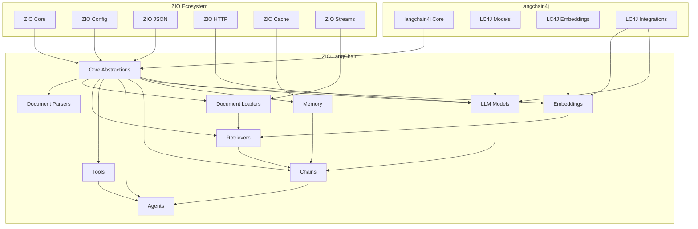

# ZIO LangChain Architecture

This document provides an overview of the ZIO LangChain architecture, explaining how the various components interact to create a complete LLM application framework.

## Table of Contents

- [Overview](#overview)
- [Core Design Principles](#core-design-principles)
- [System Architecture](#system-architecture)
- [Module Structure](#module-structure)
- [Key Abstractions](#key-abstractions)
- [Integration Patterns](#integration-patterns)
- [Resource Management](#resource-management)
- [Error Handling](#error-handling)
- [Extension Points](#extension-points)

## Overview

ZIO LangChain is a comprehensive Scala 3 library that wraps langchain4j in a purely functional, ZIO-based API. It provides a type-safe, composable way to build LLM-powered applications with proper resource management via ZIO.

The library is designed to provide an idiomatic Scala/ZIO interface to langchain4j while leveraging ZIO's effect system, resource management, and other features to create a more robust and composable API.

## Core Design Principles

ZIO LangChain follows these key design principles:

1. **Pure Functional**: All operations are represented as ZIO effects
2. **Idiomatic Scala**: Leverage Scala 3 features for a clean, expressive API
3. **ZIO Semantics**: Follow ZIO conventions and patterns
4. **Type Safety**: Maintain or enhance type safety of the original library
5. **Compositional**: Enable easy composition of components
6. **Efficient**: Minimize overhead compared to direct Java API usage

## System Architecture

The following diagram shows the high-level architecture of ZIO LangChain:



## Module Structure

ZIO LangChain is organized into the following modules:

| Module | Description |
|--------|-------------|
| `core` | Core abstractions and interfaces |
| `models` | LLM model implementations |
| `embeddings` | Embedding model implementations |
| `memory` | Conversation memory implementations |
| `document-loaders` | Document loading utilities |
| `document-parsers` | Document parsing utilities |
| `retrievers` | Document retrieval implementations |
| `chains` | Chain implementations |
| `agents` | Agent implementations |
| `tools` | Tool definitions and implementations |
| `examples` | Example applications |
| `integrations` | Integration with specific providers |

Each module has a specific responsibility and depends on the core module, plus any other required modules.

## Key Abstractions

### Core Abstractions

- **LLM**: Interface for language models
- **EmbeddingModel**: Interface for embedding models
- **Document**: Representation of a text document with metadata
- **Memory**: Interface for conversation memory
- **Retriever**: Interface for document retrieval
- **Chain**: Interface for composable operations
- **Agent**: Interface for autonomous systems
- **Tool**: Interface for tools used by agents

### Domain Types

- **ChatMessage**: Represents a message in a chat conversation
- **ChatResponse**: Represents a response from a chat model
- **Embedding**: Vector representation of text
- **TokenUsage**: Tracks token usage for LLM calls

## Integration Patterns

### Java Interoperability

ZIO LangChain provides a clean interface over the Java-based langchain4j library:

- **Clean Boundaries**: Java interop happens at the edges of the API
- **Conversion Utilities**: Tools for converting between Java and Scala types
- **Direct Access**: When needed, access to underlying Java APIs
- **Extension Points**: API designed for extending with Java components

### ZIO Integration

The library integrates with several ZIO modules:

- **ZIO Core**: Effect system and resource management
- **ZIO Config**: Type-safe configuration
- **ZIO JSON**: JSON serialization/deserialization
- **ZIO HTTP**: For API clients
- **ZIO Cache**: For caching results
- **ZIO Streams**: For streaming responses

## Resource Management

ZIO LangChain uses ZIO's resource management capabilities for safe and efficient handling of resources:

1. **ZIO Layers**: Resources are managed via ZLayer
2. **Scoped Resources**: Resources requiring cleanup use ZIO's scoped resources
3. **Connection Pooling**: Implemented for external APIs
4. **Graceful Shutdown**: All resources can be gracefully released

```scala
// Example of resource management with ZLayer
val openAILayer = OpenAILLM.live.provide(
  ZLayer.succeed(
    OpenAIConfig(
      apiKey = sys.env.getOrElse("OPENAI_API_KEY", ""),
      model = "gpt-3.5-turbo"
    )
  )
)
```

## Error Handling

The library provides a comprehensive error hierarchy:

- **LangChainError**: Base error type
- **LLMError**: Errors from language models
- **EmbeddingError**: Errors from embedding models
- **RetrieverError**: Errors from document retrieval
- **MemoryError**: Errors from memory components
- **AgentError**: Errors from agent execution

ZIO's error channel is used for propagating these errors, allowing for typed error handling.

## Extension Points

ZIO LangChain is designed to be extensible in several ways:

1. **Custom Model Implementations**: Implement the LLM or EmbeddingModel interfaces
2. **Custom Retrievers**: Implement the Retriever interface
3. **Custom Memory**: Implement the Memory interface
4. **Custom Chains**: Implement the Chain trait
5. **Custom Agents**: Implement the Agent trait
6. **Custom Tools**: Implement the Tool trait
7. **Custom Document Loaders**: Implement the DocumentLoader interface
8. **Custom Document Parsers**: Implement the DocumentParser interface

Each of these extension points is well-defined with a clean interface that follows ZIO patterns.