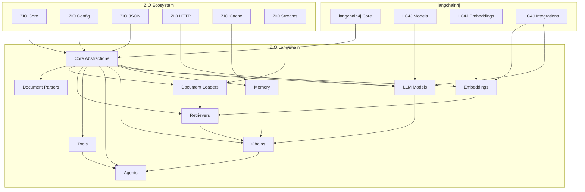

# ZIO LangChain: Architectural Design Document

## 1. Introduction

ZIO LangChain is a comprehensive Scala 3 library that wraps langchain4j in a purely functional, ZIO-based API. This design document outlines the architecture, components, and implementation strategy for creating an idiomatic Scala/ZIO wrapper around the Java-based langchain4j library.

### 1.1 Project Goals

- Create an idiomatic Scala 3/ZIO 2 wrapper around langchain4j
- Leverage ZIO's effect system for all operations
- Provide proper resource management via ZIO
- Support all major langchain4j features and components
- Integrate with the ZIO ecosystem (ZIO Config, ZIO JSON, ZIO HTTP)
- Design for extensibility and composition

### 1.2 Design Principles

- **Pure Functional**: All operations are represented as ZIO effects
- **Idiomatic Scala**: Leverage Scala 3 features for a clean, expressive API
- **ZIO Semantics**: Follow ZIO conventions and patterns
- **Type Safety**: Maintain or enhance type safety of the original library
- **Compositional**: Enable easy composition of components
- **Efficient**: Minimize overhead compared to direct Java API usage

## 2. Project Structure

```
zio-langchain/
├── project/
│   ├── build.properties
│   ├── plugins.sbt
├── modules/
│   ├── core/                  # Core abstractions and interfaces
│   ├── models/                # LLM model implementations
│   ├── embeddings/            # Embedding model implementations
│   ├── memory/                # Memory implementations
│   ├── document-loaders/      # Document loading utilities
│   ├── document-parsers/      # Document parsing utilities
│   ├── retrievers/            # Document retrieval implementations
│   ├── chains/                # Chain implementations
│   ├── agents/                # Agent implementations 
│   ├── tools/                 # Tool definitions and implementations
│   ├── examples/              # Example applications
│   └── integrations/          # Integration with specific providers
│       ├── openai/
│       ├── anthropic/
│       ├── huggingface/
│       └── ...
├── build.sbt
├── README.md
└── LICENSE
```

## 3. Core Architecture

Below is a diagram representing the core architecture of ZIO LangChain:



## 4. Module Design

### 4.1 Core Module

The core module defines the fundamental abstractions that the rest of the library builds upon.

#### 4.1.1 Domain Types

```scala
// Core domain types
object domain:
  // Message types for chat models
  enum Role:
    case User, Assistant, System, Tool
    
  case class ChatMessage(role: Role, content: String, metadata: Map[String, String] = Map.empty)
  
  case class ChatResponse(
    message: ChatMessage,
    usage: TokenUsage,
    finishReason: Option[String] = None
  )
  
  case class TokenUsage(
    promptTokens: Int, 
    completionTokens: Int, 
    totalTokens: Int
  )
  
  // Document representation
  case class Document(
    id: String,
    content: String,
    metadata: Map[String, String] = Map.empty
  )
  
  // Embeddings
  opaque type Embedding = Vector[Float]
  object Embedding:
    def apply(values: Vector[Float]): Embedding = values
    extension (e: Embedding)
      def values: Vector[Float] = e
      def dimension: Int = e.size
      def cosineSimilarity(other: Embedding): Float = // implementation
```

#### 4.1.2 Error Types

```scala
sealed trait LangChainError extends Throwable

object errors:
  case class LLMError(
    cause: Throwable,
    message: String = "LLM error occurred"
  ) extends LangChainError
  
  case class EmbeddingError(
    cause: Throwable,
    message: String = "Embedding error occurred"
  ) extends LangChainError
  
  case class RetrieverError(
    cause: Throwable,
    message: String = "Retrieval error occurred"
  ) extends LangChainError
  
  case class MemoryError(
    cause: Throwable,
    message: String = "Memory error occurred"
  ) extends LangChainError
  
  case class AgentError(
    cause: Throwable,
    message: String = "Agent error occurred"
  ) extends LangChainError
```

#### 4.1.3 Core Interfaces

```scala
// Core LLM interface
trait LLM:
  def complete(prompt: String): ZIO[Any, LLMError, String]
  def completeChat(messages: Seq[ChatMessage]): ZIO[Any, LLMError, ChatResponse]
  
  // Streaming variants
  def streamComplete(prompt: String): ZStream[Any, LLMError, String]
  def streamCompleteChat(messages: Seq[ChatMessage]): ZStream[Any, LLMError, ChatResponse]

// Embedding model interface
trait EmbeddingModel:
  def embed(text: String): ZIO[Any, EmbeddingError, Embedding]
  def embedAll(texts: Seq[String]): ZIO[Any, EmbeddingError, Seq[Embedding]]
  
  def embedDocument(document: Document): ZIO[Any, EmbeddingError, (Document, Embedding)] =
    embed(document.content).map(embedding => (document, embedding))
    
  def embedDocuments(documents: Seq[Document]): ZIO[Any, EmbeddingError, Seq[(Document, Embedding)]] =
    ZIO.foreachPar(documents)(embedDocument)
```

#### 4.1.4 Configuration

```scala
// Base configuration traits
trait ModelConfig
trait EmbeddingConfig
trait RetrieverConfig
trait AgentConfig

// Example OpenAI config
case class OpenAIConfig(
  apiKey: String,
  model: String,
  temperature: Double = 0.7,
  maxTokens: Option[Int] = None,
  organizationId: Option[String] = None,
  timeout: Duration = 60.seconds
) extends ModelConfig derives ConfigDescriptor
```

### 4.2 Models Module

The models module provides ZIO-based wrappers for langchain4j's model implementations.

```scala
object OpenAIModels:
  val live: ZLayer[OpenAIConfig, Nothing, LLM] = 
    ZLayer {
      for 
        config <- ZIO.service[OpenAIConfig]
        client <- ZIO.attempt {
          OpenAiClient.builder()
            .apiKey(config.apiKey)
            .timeout(config.timeout)
            .build()
        }.orDie
      yield OpenAILLM(client, config)
    }
    
class OpenAILLM(client: OpenAiClient, config: OpenAIConfig) extends LLM:
  override def complete(prompt: String): ZIO[Any, LLMError, String] =
    ZIO.attemptBlockingIO {
      client.generate(prompt)
    }.mapError(e => LLMError(e))
  
  override def completeChat(messages: Seq[ChatMessage]): ZIO[Any, LLMError, ChatResponse] =
    ZIO.attemptBlockingIO {
      val javaMessages = messages.map(convertToJavaMessage)
      val response = client.chat(javaMessages.asJava)
      convertFromJavaResponse(response)
    }.mapError(e => LLMError(e))
  
  override def streamComplete(prompt: String): ZStream[Any, LLMError, String] =
    ZStream.fromIteratorZIO(
      ZIO.attemptBlockingIO {
        val streamingResult = client.generateStreaming(prompt)
        streamingResult.iterator().asScala
      }.mapError(e => LLMError(e))
    )
  
  override def streamCompleteChat(messages: Seq[ChatMessage]): ZStream[Any, LLMError, ChatResponse] =
    ZStream.fromIteratorZIO(
      ZIO.attemptBlockingIO {
        val javaMessages = messages.map(convertToJavaMessage)
        val streamingResult = client.chatStreaming(javaMessages.asJava)
        streamingResult.iterator().asScala.map(convertFromJavaResponse)
      }.mapError(e => LLMError(e))
    )
  
  private def convertToJavaMessage(message: ChatMessage): dev.langchain4j.data.message.ChatMessage =
    // Conversion implementation
    
  private def convertFromJavaResponse(response: dev.langchain4j.data.message.AiMessage): ChatResponse =
    // Conversion implementation
```

### 4.3 Embeddings Module

```scala
object OpenAIEmbeddings:
  val live: ZLayer[OpenAIEmbeddingConfig, Nothing, EmbeddingModel] =
    ZLayer {
      for
        config <- ZIO.service[OpenAIEmbeddingConfig]
        client <- ZIO.attempt {
          OpenAiEmbeddingModel.builder()
            .apiKey(config.apiKey)
            .timeout(config.timeout)
            .build()
        }.orDie
      yield OpenAIEmbeddingModel(client)
    }

class OpenAIEmbeddingModel(client: dev.langchain4j.model.embedding.OpenAiEmbeddingModel) extends EmbeddingModel:
  override def embed(text: String): ZIO[Any, EmbeddingError, Embedding] =
    ZIO.attemptBlockingIO {
      val embedding = client.embed(text)
      Embedding(embedding.vectorAsList.asScala.map(_.toFloat).toVector)
    }.mapError(e => EmbeddingError(e))
  
  override def embedAll(texts: Seq[String]): ZIO[Any, EmbeddingError, Seq[Embedding]] =
    ZIO.attemptBlockingIO {
      val embeddings = client.embedAll(texts.asJava)
      embeddings.asScala.map(e => 
        Embedding(e.vectorAsList.asScala.map(_.toFloat).toVector)
      ).toSeq
    }.mapError(e => EmbeddingError(e))
```

### 4.4 Memory Module

```scala
trait Memory:
  def add(message: ChatMessage): ZIO[Any, MemoryError, Unit]
  def get: ZIO[Any, MemoryError, Seq[ChatMessage]]
  def clear: ZIO[Any, MemoryError, Unit]

object ChatMemory:
  val volatile: ZLayer[Any, Nothing, Memory] =
    ZLayer.succeed(VolatileMemory())
    
  // Persistent memory backed by Redis
  def redis(config: RedisConfig): ZLayer[RedisClient, Nothing, Memory] =
    ZLayer {
      for
        redis <- ZIO.service[RedisClient]
      yield RedisMemory(redis, config)
    }

// In-memory implementation
class VolatileMemory extends Memory:
  private val messages = new AtomicReference[Vector[ChatMessage]](Vector.empty)
  
  override def add(message: ChatMessage): ZIO[Any, MemoryError, Unit] =
    ZIO.succeed {
      messages.getAndUpdate(_ :+ message)
      ()
    }
    
  override def get: ZIO[Any, MemoryError, Seq[ChatMessage]] =
    ZIO.succeed(messages.get())
    
  override def clear: ZIO[Any, MemoryError, Unit] =
    ZIO.succeed {
      messages.set(Vector.empty)
    }
```

### 4.5 Document Loaders

```scala
trait DocumentLoader:
  def load: ZStream[Any, Throwable, Document]

class TextFileLoader(path: Path) extends DocumentLoader:
  override def load: ZStream[Any, Throwable, Document] =
    ZStream.fromZIO(
      ZIO.attemptBlockingIO {
        val content = Files.readString(path)
        Document(
          id = path.toString,
          content = content,
          metadata = Map("source" -> path.toString)
        )
      }
    )

class PDFLoader(path: Path) extends DocumentLoader:
  override def load: ZStream[Any, Throwable, Document] =
    ZStream.fromZIO(
      ZIO.attemptBlockingIO {
        // Use langchain4j's PDF loader under the hood
        val pdfDocument = new dev.langchain4j.data.document.loader.FileSystemPdfDocumentLoader(path.toFile).load()
        Document(
          id = path.toString,
          content = pdfDocument.text(),
          metadata = pdfDocument.metadata().asScala.toMap
        )
      }
    )
```

### 4.6 Retrievers

```scala
trait Retriever:
  def retrieve(query: String, maxResults: Int = 10): ZIO[Any, RetrieverError, Seq[Document]]

class EmbeddingRetriever(
  embeddingModel: EmbeddingModel,
  documentStore: DocumentStore,
  maxResults: Int = 10
) extends Retriever:
  override def retrieve(query: String, maxResults: Int = this.maxResults): ZIO[Any, RetrieverError, Seq[Document]] =
    for
      queryEmbedding <- embeddingModel.embed(query).mapError(e => RetrieverError(e))
      documents <- documentStore.findSimilar(queryEmbedding, maxResults)
                    .mapError(e => RetrieverError(e))
    yield documents
```

### 4.7 Chains

```scala
trait Chain[-R, +E, -I, +O]:
  def run(input: I): ZIO[R, E, O]
  
  def andThen[R1 <: R, E1 >: E, O2](next: Chain[R1, E1, O, O2]): Chain[R1, E1, I, O2] =
    Chain.sequence(this, next)

object Chain:
  def sequence[R, E, I, O, O2](
    first: Chain[R, E, I, O],
    second: Chain[R, E, O, O2]
  ): Chain[R, E, I, O2] = new Chain[R, E, I, O2]:
    override def run(input: I): ZIO[R, E, O2] =
      first.run(input).flatMap(second.run)

class LLMChain[R](llm: LLM, promptTemplate: PromptTemplate) extends Chain[R, LLMError, Map[String, String], String]:
  override def run(input: Map[String, String]): ZIO[R, LLMError, String] =
    for
      prompt <- ZIO.attempt(promptTemplate.format(input)).mapError(e => LLMError(e))
      response <- llm.complete(prompt)
    yield response

class RetrievalChain[R](
  retriever: Retriever, 
  llm: LLM, 
  promptTemplate: RetrievalPromptTemplate
) extends Chain[R, LangChainError, String, String]:
  override def run(query: String): ZIO[R, LangChainError, String] =
    for
      documents <- retriever.retrieve(query)
      prompt = promptTemplate.format(query, documents)
      response <- llm.complete(prompt)
    yield response
```

### 4.8 Agents

```scala
trait Tool[-R, +E]:
  def name: String
  def description: String
  def execute(input: String): ZIO[R, E, String]

trait Agent[-R, +E]:
  def run(input: String): ZIO[R, E, String]

class ReActAgent[R](
  llm: LLM,
  tools: Map[String, Tool[R, LLMError]],
  maxIterations: Int = 10
) extends Agent[R, AgentError]:
  override def run(input: String): ZIO[R, AgentError, String] =
    // Implementation using ZIO for control flow
    // This would convert langchain4j's agent execution into ZIO effects
```

### 4.9 Integrations Module Structure

For each integration (e.g., OpenAI, Anthropic, HuggingFace), we create a dedicated module:

```
integrations/
├── openai/
│   ├── src/main/scala/zio/langchain/integrations/openai/
│   │   ├── OpenAILLM.scala
│   │   ├── OpenAIEmbedding.scala
│   │   └── OpenAIConfig.scala
├── anthropic/
│   ├── src/main/scala/zio/langchain/integrations/anthropic/
│   │   ├── AnthropicLLM.scala
│   │   └── AnthropicConfig.scala
└── ...
```

## 5. Build Configuration

```scala
// Root build.sbt
val zioVersion = "2.0.19"
val langchain4jVersion = "0.24.0" // Use the latest version

ThisBuild / organization := "dev.zio"
ThisBuild / version := "0.1.0-SNAPSHOT"
ThisBuild / scalaVersion := "3.3.1"
ThisBuild / scalacOptions ++= Seq(
  "-Xfatal-warnings",
  "-deprecation",
  "-unchecked",
  "-feature",
  "-language:implicitConversions"
)

// Dependencies common to all modules
lazy val commonDependencies = Seq(
  "dev.zio" %% "zio" % zioVersion,
  "dev.zio" %% "zio-streams" % zioVersion,
  "dev.zio" %% "zio-json" % "0.6.2",
  "dev.zio" %% "zio-config" % "4.0.0-RC16",
  "dev.zio" %% "zio-config-typesafe" % "4.0.0-RC16",
  "dev.zio" %% "zio-test" % zioVersion % Test,
  "dev.zio" %% "zio-test-sbt" % zioVersion % Test
)

// langchain4j dependencies
lazy val langchain4jDependencies = Seq(
  "dev.langchain4j" % "langchain4j" % langchain4jVersion
)

lazy val root = project
  .in(file("."))
  .settings(
    name := "zio-langchain",
    publish / skip := true
  )
  .aggregate(
    core,
    models,
    embeddings,
    memory,
    documentLoaders,
    documentParsers,
    retrievers,
    chains,
    agents,
    tools,
    integrationOpenAI,
    examples
  )

lazy val core = project
  .in(file("modules/core"))
  .settings(
    name := "zio-langchain-core",
    libraryDependencies ++= commonDependencies ++ langchain4jDependencies
  )

lazy val models = project
  .in(file("modules/models"))
  .dependsOn(core)
  .settings(
    name := "zio-langchain-models",
    libraryDependencies ++= commonDependencies ++ langchain4jDependencies
  )

lazy val embeddings = project
  .in(file("modules/embeddings"))
  .dependsOn(core)
  .settings(
    name := "zio-langchain-embeddings",
    libraryDependencies ++= commonDependencies ++ langchain4jDependencies
  )

// Other module definitions follow the same pattern

lazy val integrationOpenAI = project
  .in(file("modules/integrations/openai"))
  .dependsOn(core, models, embeddings)
  .settings(
    name := "zio-langchain-openai",
    libraryDependencies ++= commonDependencies ++ Seq(
      "dev.langchain4j" % "langchain4j-open-ai" % langchain4jVersion
    )
  )

// Example applications
lazy val examples = project
  .in(file("modules/examples"))
  .dependsOn(core, models, embeddings, chains, agents, integrationOpenAI)
  .settings(
    name := "zio-langchain-examples",
    libraryDependencies ++= commonDependencies,
    publish / skip := true
  )
```

## 6. Implementation Strategy

The implementation will proceed in phases to deliver incremental value:

### 6.1 Phase 1: Foundation (2-3 weeks)

- Core abstractions and error types
- Basic LLM implementations
- Integration with OpenAI
- Document handling
- Embedding support
- Project setup and CI

**Deliverables:**
- Working core module
- OpenAI integration
- Basic examples

### 6.2 Phase 2: Advanced Components (3-4 weeks)

- Memory implementation
- Chain framework
- Retrieval implementation 
- Document loaders and parsers
- Additional model integrations (Anthropic, HuggingFace)

**Deliverables:**
- Complete RAG capabilities
- Memory support
- Additional integrations

### 6.3 Phase 3: Agents and Tools (3-4 weeks)

- Agent framework
- Tool integration
- Advanced patterns and examples
- Comprehensive documentation

**Deliverables:**
- Complete agent capabilities
- Example applications
- Comprehensive documentation

### 6.4 Phase 4: Optimization and Extensions (2-3 weeks)

- Performance optimization
- Additional integrations
- Community feedback integration
- Release preparation

**Deliverables:**
- Production-ready library
- Complete documentation
- First stable release

## 7. Key Design Considerations

### 7.1 Java Interoperability

- **Clean Boundaries**: Clearly define where Java interop happens (typically at the edges)
- **Conversion Utilities**: Provide utilities for converting between Java and Scala types
- **Direct Access**: Allow for direct access to underlying Java APIs when needed
- **Extension Points**: Design the API to allow for extensions that might need to interact with Java

### 7.2 Resource Management

- **ZIO Layers**: Use ZLayer for resource acquisition and release
- **Scoped Resources**: Use ZIO's scoped resources for resources requiring cleanup
- **Connection Pooling**: Implement connection pooling for external APIs
- **Graceful Shutdown**: Ensure all resources can be gracefully released

### 7.3 Configuration

- Use ZIO Config for type-safe configuration
- Support both programmatic and file-based configuration
- Allow for runtime reconfiguration of components
- Provide reasonable defaults

### 7.4 Error Handling

- Define clear error hierarchy
- Use ZIO's error channel for propagating errors
- Provide context-rich error messages
- Implement retry mechanisms for transient failures

### 7.5 Testing Strategy

- Unit tests for core logic
- Integration tests for API interactions
- Property-based testing for complex operations
- Test fixtures for common scenarios
- Mocking of external dependencies

### 7.6 Documentation

- Comprehensive API documentation
- Example-driven guides
- Architecture overview
- Best practices

## 8. Future Extensions

After the initial implementation, potential future extensions include:

- **More Model Providers**: Support for additional LLM providers
- **ZIO HTTP Integration**: Built-in HTTP server capabilities for deploying models
- **Vector Database Integrations**: Native support for vector databases
- **ZIO Schema Integration**: Schema-based serialization/deserialization
- **Custom Tooling**: Development tools specific to ZIO LangChain
- **Performance Optimizations**: Specialized optimizations for Scala/ZIO

## 9. Conclusion

This architectural design outlines a comprehensive approach to creating a ZIO 2 wrapper around langchain4j. The modular structure, phased implementation, and focus on idiomatic Scala/ZIO APIs will result in a powerful, type-safe, and purely functional library for building LLM-powered applications.

By leveraging ZIO's effect system, resource management, and concurrency primitives, ZIO LangChain will provide significant advantages over direct usage of the Java API, while maintaining full access to the capabilities of langchain4j.